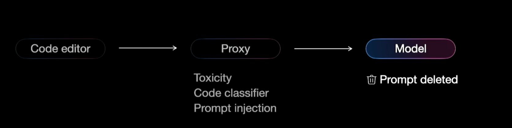
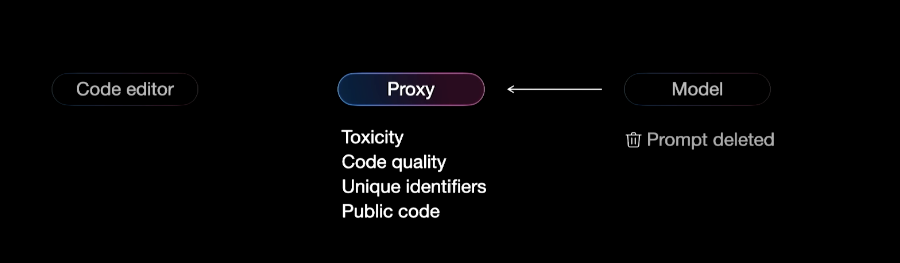
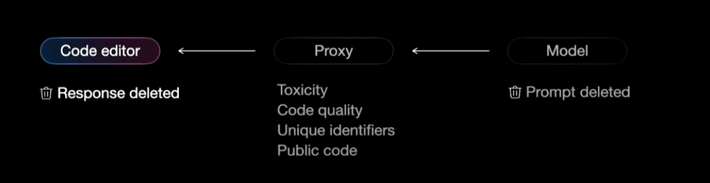

# Behind the scenes of Github Copilot

Github Copilot is a code completion tool that analyses your code and gives you in-line suggestions as you type. It also has a chat interface, which helps you ask questions about your code base, generate documentation, refactor code, and more.

In this blog post, we will be looking into what happens behind the scenes as you are prompted to make suggestions when you write the code, trying to understand how it works. Knowing the internal understanding of how co-pilot works can help you be more efficient with it.

We will divide the system into 3 components, which are the code editor, proxy (Github servers), and model. We will understand each and every component one by one.

## Code Editor

In the case of code completion, to gather all the relevant data that is required as context to be fed into the model, the copilot constantly monitors the cursor position and analyses the code around it. It breaks all the code into tokens and performs Jacobian difference algorithms on all the other tabs that are open in the code editor.

Jacobian difference algorithms are basically a **Venn** diagram comparing two pieces of content, which helps the co-pilot know which parts of the code have high overlap or are referencing the same variable names and method names, which allows the co-pilot to assemble a prompt that is mixed with the relevant content. Writing a good prompt is essential, as it helps the model gain domain expertise.

In the case of the chat interface, there is other information that can be added to the prompt in order to generate better code suggestions and chat replies. Some of the useful contexts are

- **Directory tree**: hierarchy and organisation of files and folders within the project
- **Terminal information**: commands executed, build logs, system output
- **Build output**: complication results, error messages, warnings

Copilot also allows you to use tagging with elements like @Workspace to pull up information from these sources into your prompt. There’s also a huge amount of additional context that can be helpful, which we will see in the upcoming sections.

## Proxy Service

Proxy service performs 2 operations:

1. Preprocessing
2. Post Processing

### PreProcessing

After getting the relevant data from the code editor the data is then sent to proxy server which is a backend service at github where the input is sanitized by removing any toxic content from the user, blocking prompts which are not relevant to software engineering, checking from hateful speech or evidence of hacking or prompt injection.

Once these steps are done the relevant prompt is generated by the proxy service and fed to the model.

## Model

After sanitizing the user prompt, the backend service at github passes it to ChatGPT. For code completion tasks (where Copilot suggests code snippets as you program), for best user experience Github maintains very low latency 300-400 ms. For that reason they use GPT-3.5.

For the conversational AI bot, GitHub can tolerate higher latency and they need more intelligence, so they use GPT-4. At this point the prompt is also deleted from the github servers as they do not want to use user’s propriety data.

## Proxy Service

After the response is returned from the model Proxy service performs post processing tasks before sending the result back to the code editor.

In this step the service again checks for toxic data, evidence of security vulnerabilities etc. Github also has a custom model written by which checks for security vulnerabilities, personal identifiable information.

Another important step that github does in this journey back is if the response from the model is greater than 150 characters, they compare the data against an index of all the data in Github which are billions of files to make sure that they are not violating any code licenses. The amazing metric is that Github does this in 20-30ms which is just a miracle of engineering.

Once the response is generated and returned to the user to be displayed in the code editor, if the user selects the response or not, that metric is then sent to the github servers.

## Another Way of Expanding the Context Window

Apart from getting context from the codebase, terminal information and buildout are discussed in the code editor section. Copilot uses R*etrieval-Augmented Generation (RAG).*

With RAG, any additional context that might be useful for the prompt is fetched from the organisation's assets using documentation, codes, and issues.

Another feature Copilot has planned is to expand the context window for plugins. This allows Copilot to call another API or service to gather data and perform actions.

For example, let’s say you receive a notification about an outage in your service. You can ask Copilot to check Datadog and retrieve a list of the critical errors from the last hour. Then, you might ask Copilot to find the pull requests and authors who contributed to the code paths of those errors.

## **Custom models with fine tuning**

Github also offers enterprises custom models. More specifically, they can fine-tune ChatGPT to generate better responses.

Some scenarios where fine-tuning is useful include

- **Stylistic Preferences:** A team might have specific coding styles, naming conventions, formatting guidelines, etc. Using a fine-tuned version of ChatGPT will enable Copilot to follow these rules.
- **API/SDK Versions**: a team might be working with a specific version of an API/SDK. The ChatGPT model can be fine-tuned on a codebase that utilises the targeted version to provide suggestions that are compatible and optimised for that specific development environment.
- **Proprietary Codebases:** Some companies have proprietary codebases that use technologies not available to the public. Fine-tuning ChatGPT allows it to learn the patterns of these codebases for more relevant suggestions.

References:

https://www.youtube.com/watch?v=m0skYNIO3mk

https://en.wikipedia.org/wiki/Jacobian_matrix_and_determinant

https://github.com/features/copilot/plans
