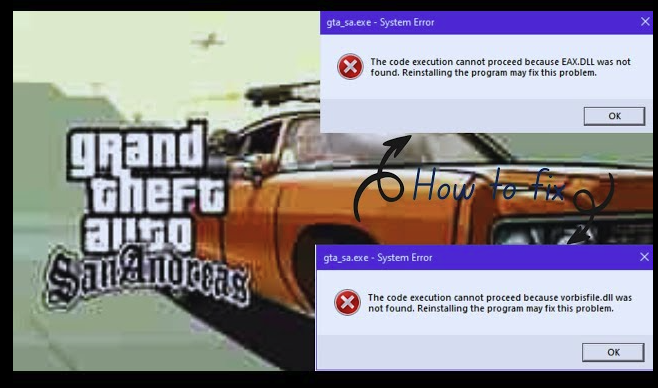

# Ever Faced a DLL Not Found Error While Running Your PC Game as a child? Let's See What That was!

**Grand Theft Auto: San Andreas** was a game that I was always fascinated with as a child. I always wanted to play it, and I remember having a 128MB RAM personal computer at home, which was never enough for running that game. I pleaded in front of my father to get a new RAM chip, which would increase the size of my PC from 128 MB to 512 MB. I remember being so happy when he finally did that.

I remember calling my only rich friend and asking him if I could bring my CD (Google what CD is for young people) to his home and copy the game. Once he agreed, I straightaway went to his home and checked and tried copying the game. Another issue popped up when I tried that. Well, back in the day, I took the CD, which had 700 MB of space, and the game was around 4 GB. I tried to be a cleaver and just copied the.exe file and went home. Back home, I was so disappointed when I saw something like this.

I tried fixing it for a day but eventually gave up and played GTA vice city for the rest of my life.

### 15 years Later

Almost a month ago I was debugging a potential memory leak issue at my work place. It involved me getting deep into Operating Systems basic where I came across something called Linker. I did not pay attention at that time on diving deep into it. But few days ago I got curious on what it could be and started to read about it.

### Linker

Every program we write uses various libraries which are needed by the program to run. We need all these libraries to be in a single file for it to actually execute. That is what is the job of the linker. Other than this basic part linkers also do address allocation which involves assigning memory objects to the various parts of the program. So basically linker transforms a compile code into a runnable program ensuring all the pieces fit together.

Linking is basically of 2 types:

1. Static Linking: It is performed during the compilation of source program. Linking is performed before execution in static linking. It takes collection of relocatable object file and command-line arguments and generates a fully linked object file that can be loaded and run.
2. Dynamic Linking: The executable contains references to shared libraries (DLLs) that are loaded into memory at runtime. This keeps the executable smaller but requires the presence of the DLLs on the system

Dynamic Linking is the reason why we had small .exe files in our games. If the games did static linking our .exe file would have be one big 4GB file.

### The good old DLL not found error

When I copied only the .exe file without the accompanying DLLs, the executable couldn’t find the dynamic libraries it depended on.

Here’s why it happened:

1. **Dependency on External Libraries**: GTA San Andreas relied on DLLs for additional functionalities. In my case since I only had the .exe file it could not run.
2. **Dynamic Linking**: When an executable is run, the OS loads the required DLLs into memory. Since the executable was expecting the DLL files in that expected location, the OS raised a “DLL not found” error.

### Conclusion

I know kids of this generation will never most probably see this error or try to be smart like me as there is not storage problem. But well you now know why did you saw this error in your childhood when you like me tried to act smart.

Schedule a mock System Design Interview with me : [https://www.meetapro.com/provider/listing/160769](https://www.meetapro.com/provider/listing/160769)

Linkedin: [https://www.linkedin.com/in/mayank-sharma-2002bb10b/](https://www.linkedin.com/in/mayank-sharma-2002bb10b/)

My website : [https://www.imayanks.com/](https://www.imayanks.com/)