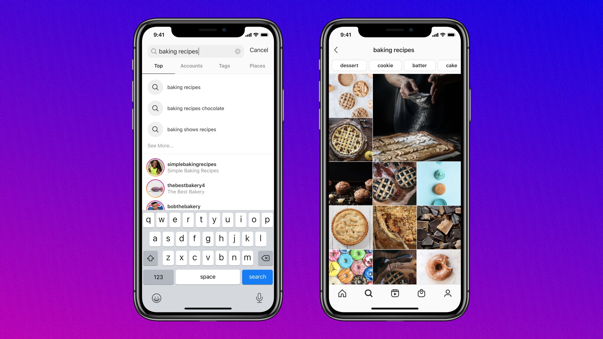

# Here is How Instagram Selects what you see in Explore page

Have you even been stuck in a condition where you are just scrolling and you realise hours have passed?

Do you ever wonder how Instagram knows exactly what you'd love to see next?

From the latest sports highlights to your favourite skincare tips, the Explore page curates a never-ending stream of content tailored just for you. Behind this magic lies a complex, ever-evolving system of recommendation algorithms and machine learning models.

## Challenges?

Billions of high-quality media are shared on Instagram, creating an extensive inventory for the Explore page. This media is ever-evolving and ranges from various categories such as sports, music, skincare, and many more.

Instgram engineers had to do various experiments to iterate from one algorithm to the next, for which they created their own domain-specific language, **IGQL.**

While experimenting with the Explore recommendation system, they realised the following problems:

- **Diverse Interests**: There are countless different interest categories on Instagram, each with a specific focus (e.g., soccer, pets).

- **Content Classification**: Due to the enormous and constantly changing amount of content, it was very challenging to maintain an accurate and up-to-date classification system for all possible interests.

- **Content-Based Models**: The models used by Instagram relied on actual media (images, videos, etc.) to make recommendations. Due to the vast variety of interests, these models struggled to effectively understand and categorise all the different topics people might be interested in.

To tackle the following problems, they had to work on a different system of recommendation. Now there is an engineering challenge for them to try to break the problem into small parts. This is where their next solution came into play. Instagram engineers realised that since they had a large number of interest-focused accounts based on specific themes, For example, there are accounts that share content related to tech; some accounts share content around basketball, etc.

Due to this, instead of focusing on content-level recommendations, they decided to move ahead with account-level information.

### Account Embeddings

Instagram built account embeddings to more efficiently identify the accounts that are similar to each other. So they look at the whole account instead of individual posts to better understand and recommend content. They used an embedding framework called ig2vec to figure out which accounts are similar to the user based on user behaviour on the app.

ig2vec works like word2vec embedding, which learns about words by looking at the words around them in sentences. Similarly, is2vec learns about accounts by looking at which accounts users interact with, treating these interactions like a sequence in a sentence.

There are many different ways people can engage with accounts and media on Instagram (e.g., follow, like, comment, save, and share). There are also different media types (e.g., photo, video, stories, and live), which means there are a variety of sources we can construct using a similar scheme.

This approach helps Instagram recommend accounts (and their content) that align with a user's interests more effectively.

Let us understand this with an example:

If a user frequently likes and interacts with accounts about vintage cars, ig2vec will recognise this pattern. It will treat these interactions as a sequence and identify other accounts related to similar themes, such as accounts featuring car restoration projects or classic car shows. This helps Instagram recommend similar accounts (and their content) that align with the user's interests.

By using this framework Instagram can predict accounts with which a person is likely to interact in a given session with an Instagram app.

With different types of sources, Instagram are able to find tens of thousands of eligible candidates for the average person. Instgram uses various filters before building the eligible inventory for each person. In the last step they leverage ML systems that help detect and filter contents like span, content violating their policies etc.

Before moving to the preselecting stage out of thousands of media they identify 500 best cancidates which are then sent to the ranking stage for preselection.

In the next section let us see how Instagram preselects the accounts for us in the Explore page.

## Preselecting relevant accounts

After the identifying the relevant accounts based on the user’s interest, Instagram needs a way to rank these accounts so that the page is interesting and fresh.

In order to handle this efficiently, Instagram uses what they call ranking distillation model to preselect candidates before using more complex modes. But then the question arises why can’t they just use the models on these accounts? Why do they need a distillation model to narrow down the search?

EFFICIENCY

Well evaluating a large number of media pieces for every scroll and action for the user on the site is very resource intensive but it is also necessary to strike a balance between the 2 they use the distillation model.

The distillation model basically does the following

1. A super-lightweight model is trained to approximate the main ranking models. This involves recording input candidates with features and outputs from the more complex models.

2. The top-ranked posts from the distillation model are used as candidates for the high-performance ranking models.

With 500 candidates available for ranking, Instagram use a three-stage ranking infrastructure to help balance the trade-offs between ranking relevance and computation efficiency.

The raking system Instagram uses is as follows:

1. First pass: the distillation model mimics the combination of the other two stages with minimal features and picks the 150 highest-quality and most relevant candidates out of 500.
2. Second pass: a lightweight neural network model with a full set of dense features picks the 50 highest-quality and most relevant candidates.
3. Final pass: a deep neural network model with a full set of dense and sparse features. Picks the 25 highest-quality and most relevant candidates (for the first page of the Explore grid).

## Conclusion

What I have realised the more I learn about huge systems is that in every step they try to use the divide and conquer approach; even in the case of Instagram, they try to trim down to the very basic level until they use advanced machine learning models. This is also similar to why YouTube had a notification button in addition to a subscribe button for people with a large audience, as they wanted to bring down the scale of the problem they wanted to solve.
