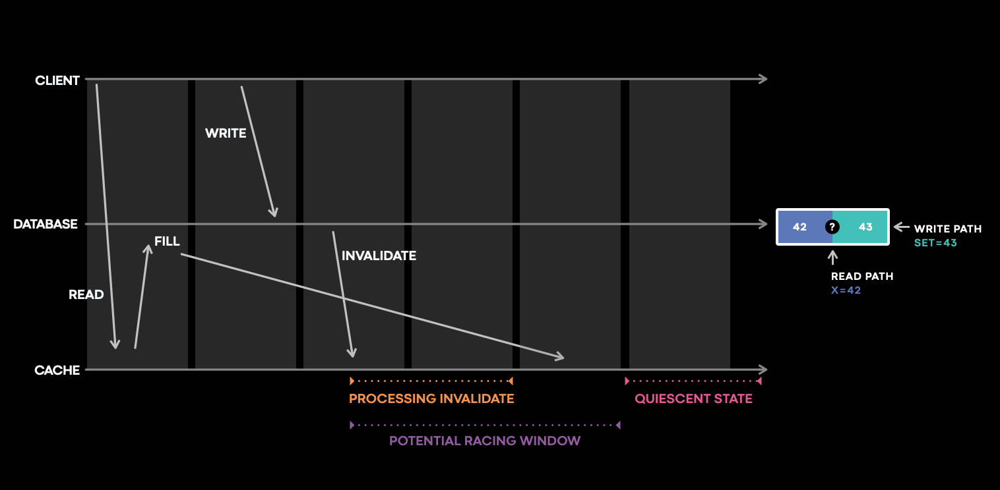

# How meta improved their cache consistency to 99.99999999

### Introduction

Caching is a powerful technique used across various aspects of computer systems, from hardware like caches to operating systems, web browsers, and especially backend development. For a company like Meta, caching is super important as it helps them reduce latency, scale heavy workloads, and save money. As their use cases are so cache heavy, it introduces another set of problems for them, which is cache invalidations.

Over the years, Meta has improved their cache consistency measure from 99.9999 (six nines) to 99.99999999 (10 nines), which means less than 1 out of 10 billion cache writes would be inconsistent in their cache clusters.

In this blog, we will focus on four main parts:

1. What are cache invalidation cache consistency?
    
    and
    
2. Why does Meta care about cache consistency so deeply that even six nines are not enough?
3. How Meta’s monitoring system helped them improved cache invalidation and cache consistency and fix bugs.

# **Cache Invalidation and cache consistency**

By definition, cache does not hold the source of truth for your data, so there should be a process of actively invalidating the stale cache entries when data in the source of truth changes. If during the process of invalidation, the invalidation gets mishandled, it can indefinitely leave inconsistent values in the cache that are different from what’s in the source of truth.

**So how can we invalidate the cache?**

We can have something as a TTL to maintain its freshness so that there are no cache invalidations from any other system. But in this blog, where we discuss meta’s cache consistency, we will assume that the invalidation action is being carried out by something other than the cache itself.

First let us look how can cache inconsistency be introduced:

.webp)

Please assume that 1,2,3,4 are timestamps in increasing sequence

1. The cache first tries to fill the value from the DB
2. But before the x =42 value reaches the cache some operation updated the db for value x=43
3. The db sends the cache invalidation event for x=43 and it arrives to cache before x=42, and the cache value is set at 43.
4. The event x =42 arrives to cache now and the cache is set to 42 and the inconsistency is introduced.

To solve this problem we can use a version field to perform conflict resolution so that the older version never overrides the current version. This solution would work for almost 99% of the companies which are there on the internet, but the scale on which meta operates even this might not be enough due to the complexity of their systems.

# **Why do meta care about cache consistency so deeply?**

From meta’s perspective, cache inconsistencies are almost as bad as data loss on a database, and from the user’s perspective, they could lead to a very bad user experience.

When you send a user a DM on Instagram, behind the scenes, there is a mapping for the user to its primary storage, where the messages are stored for the user.

Imagine three users here. Bob, Mary, and Alice. Both the users send Alice a message. Bob is in the USA Alice is in Europe, and Mary is in Japan. So the system will query in the nearest region close to where the user lives, so send the message to Alice data store. In this case, when the TAO replica queried the region where BOB and Mary live, they both had inconsistent data, and it sent the message to the region in which none of it had Alice’s messages.


In the above case there would be message loss and bad user experience so it was one of the top problems for meta to solve.

# **Monitoring**

To solve the cache invalidation and cache consistency problem, the first step involves measurement. If we can accurately measure the cache consistency and sound an alarm when there are inconsistent entries in the cache, Meta made sure that their measurement did not contain any false positives, as the on-call engineers would learn to ignore it and the metric would lose trust and become useless.

Before we dive deep into the actual solution that Meta implemented, the easiest solution would have been to log and trace every cache change in state. This solution would have been feasible in the case of small workloads, but Meta’s system was doing more than 10 trillion cache fills a day. Logging and tracing all the cache states would turn a ready-heavy cache workload into an extremely heavy work load, and let’s not even think about dubugging this.

# **Polaris**

Polaris at a very high level, interacts with a stateful service as a client and assumes no knowledge of service internals. Polaris works on the principle that “Cache should eventually be consistent with the database.” Polaris receives an invalidation event and queries all the replicas to verify if any other violations occurs. For example: if Polaris receives an invalidation event that says x=4 version 4, it then checks all the cache replicas as a client to verify whether any violations of any invariant occur. If one replica returns x=3 @ version 3, Polaris flags it as inconsistent and requeues the sample to later check it against the same target cache host. **Polaris reports inconsistencies at certain timescales, e.g., one minute, five minutes, or 10 minutes.**


This multi-timescale design not only allows Polaris to have multiple queues internally to implement backoff and retries efficiently, but also essential for preventing it from producing false positives.

Let us understand this with one more example:

Suppose Polaris receives an invalidation with x = 4, version 4. But when the Polaris checks the cache, it cannot find an entry for x, and it should flag this as an inconsistency. In this case, there are two possibilities.

1. x was invisible at version 3, but the version 4 write is the latest write on the key, and it is indeed a cache inconsistency.
2. It is possible that there’s a version 5 write that deletes the key x, and perhaps Polaris is just seeing a more recent view of the data than what is in the invalidation event.

Now, how do we make sure which of the two cases is the correct one?

To verify, among the 2 cases, Polaris needs to check by querying the database. The queries that bypass the cache may be compute-intensive and can also expose the database to risks because protecting the database and scaling read heavy workloads are two of the most common use cases for caches. So, we can’t send too many queries to the system.

Polaris solves this problem by delaying performing such checks and making the call to the database until the inconsistent sample crosses a set threshold, such as 1 minute or 5 minutes. Polaris products the metric that says “N nines of cahce writes are consistent in M minutes.” So right now, Polaris provides a metric that says 99.99999999 cache is consistent for the five-minute timescale.

Now let us see how polaris helped meta solved a bug using a coding example on how cache inconsistencies can be produced.

Let us understand the flow with a coding example:

Let us suppose a cache which maintains a key to meta data mapping and key to version mapping.

```python
cache_data = {}
cache_version = {}

meta_data_table = {"1": 42}
version_table = {"1": 4}
```

1. When the read request comes the value is first checked in the cache, if the value is not present in the cache then the value is returned from the database


```python
def read_value(key):
    value = read_value_from_cache(key)
    if value is not None:
        return value
    else:
        return meta_data_table[key]
```

```python
def read_value_from_cache(key):
    if key in cache_data:
        return cache_data[key]
    else:
        fill_cache_thread = threading.Thread(target=fill_cache(key))
        fill_cache_thread.start()
        return None
```

2. The cache returns the None result and then starts to fill the cache from the database. I have used threads here to make the process async.

```python
def fill_cache_metadata(key):
    meta_data = meta_data_table[key]
    print("Filling cache meta data for", meta_data)
    cache_data[key] = meta_data
    
def fill_cache_version(key):
    time.sleep(2)
    version = version_table[key]
    print("Filling cache version data for", version)
    cache_version[key] = version    

def write_value(key, value):
    version = 1
    if key in version_table:
        version = version_table[key]
        version = version + 1

    write_in_databse_transactionally(key, value, version)
    time.sleep(3)
    invalidate_cache(key, value, version)
    
 def write_in_databse_transactionally(key, data, version):
    meta_data_table[key] = data
    version_table[key] = version   
```

3) In the meanwhile when the version data is filled into the cache the the database has the new write request updating the meta data value and the version value. At this moment it looks like a bug but it is not as the cache invalidation should bring back the cache to the consistent state with the database.(Note I have added the time.sleep in cache and write in database function to reproduce the issue).

```python
def invalidate_cache(key, metadata, version):
    try:
        cache_data = cache_data[key][value] ## To produce error
    except:
        drop_cache(key, version)
        

def drop_cache(key, version):
    cache_version_value = cache_version[key]
    if version > cache_version_value:
        cache_data.pop(key)
        cache_version.pop(key)
        
read_thread = threading.Thread(target=read_value, args=("1"))
write_thread = threading.Thread(target=write_value, args=("1",43))
print_thread = threading.Thread(target=print_values)        
```

4  Later, during the cache invalidation the due to some reason the invalidation failed and the exception handler had the condition to drop the cache in that case. 

5) The drop cache function had the logic that of the latest value is greater than the cache_version_value then delete the key, but in our case this is not. So this leads to leaving stale metadata in cache indefinitely

Please keep in mind this is the very simplified variation of how the bug may have occurred, The actual bug has even more intricacy, with database replication and cross region communication involved. The bug gets triggered only when all steps above occur and happen specifically in this sequence. The inconsistency gets triggered very rarely. The bug hides in the error handling code behind interleaving operations and transient errors. 

### **Consistency tracing**

Now that you are on call and have been paged for the cache inconsistencies from Polaris, it is most important to check the logs and where the issue could be. As we discussed previously, logging each and every cache data change is almost impossible, but what if we only log the changes that have the potential to cause the change?



If we see the above code that we implemented the issue can arise in case if the cache did not receive the invalidation event or the invalidation did not work. From the oncall’s perspective we need to check the following:

- Did the cache server receive the invalidate?
- Did the server process the invalidate correctly?
- Did the item become inconsistent afterwards?

Meta has built a stateful tracing library that logs and traces cache mutations in this small purple window, where all the interesting and complicated interactions trigger bugs that lead to cache inconsistencies.

## Conclusion

For any distributed systems solid monitoring and logging systems are essential to make sure we catch the bug and when we catch the bug we are able to find the root cause quickly so that we mitigate the issue. Using meta’s example, Polaris identified the anomaly and fired an alarm immediately. With information from consistency tracing, it took on-call engineers less than 30 minutes to locate the bug.

References : [https://engineering.fb.com/2022/06/08/core-infra/cache-made-consistent/](https://engineering.fb.com/2022/06/08/core-infra/cache-made-consistent/)

Schedule a mock System Design Interview with me : [https://www.meetapro.com/provider/listing/160769](https://www.meetapro.com/provider/listing/160769)

You can find my implementation of the bug creation here : [https://github.com/Mayank-Sharma-27/meta-cache-made-consistent](https://github.com/Mayank-Sharma-27/meta-cache-made-consistent)

Linkedin: [https://www.linkedin.com/in/mayank-sharma-2002bb10b/](https://www.linkedin.com/in/mayank-sharma-2002bb10b/)

> https://www.buymeacoffee.com/imayanks
>