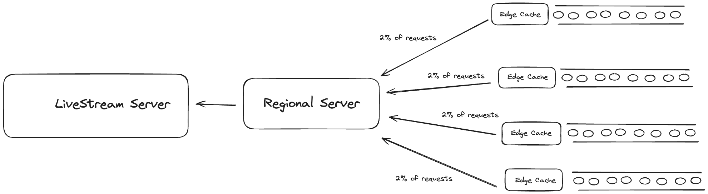
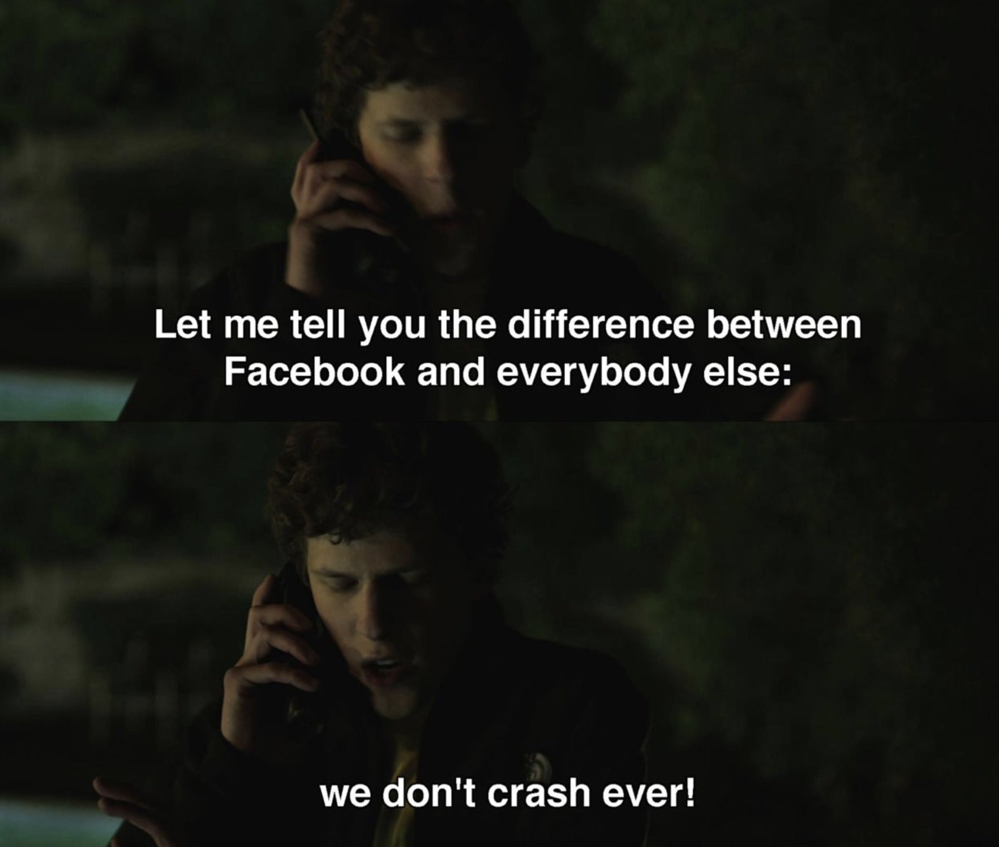
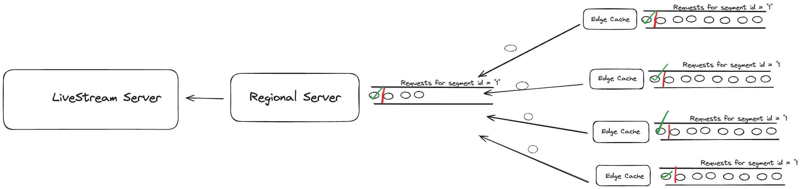

# How meta solved solved “thundering herd” problem?

In 2015 Facebook rolled Live for Facebook, which allowed verified public figures to broadcast live videos to facebook. This was also followed up with another set of live streaming events like Laliga in Asia, Live for all the users etc.

In this blog we will try to understand the engineering challenge that facebook experienced and how did they solved them.

### What is thundering herd?

A thundering problem in computer science is a case when too many requests are made to the resource at the same time causing a system lag, dropout and disconnection from the server.

In case of facebook this could happen if some live stream got viral, and a lot of people joined that live stream at once. This would lead to huge traffic spikes at once causing stampede in the system.

### How facebook serves the stream?

To solve the issue with the all the clients connecting to a live stream server at once, facebook has a network of edge caches distributed around the globe which which serves the stream.

A live video is split into three second HLS video and when the segment is requested it is handled by one of the HTTP edge caches around the world. If the segment is already in the edge cache then it is returned to the user otherwise it is fetched from the regional server. 

If the regional server does not have the segment as well, then it will fetch the segment from the livestream server. Facebook observed that around 98% of the requests were fulfilled with the edge cache and only 2% of the requests from each edge cache were fetched from the regional server.

### How regional server became the bottleneck?

The above architecture works well but at the scale of facebook with some live streams with very huge spikes even with 2% of the requests getting passed was a huge number. This lead to increased load on the regional server and a risk of failure at the origin level.

But if there is one thing about facebook which is commendable it is :

To resolve this problem facebook applied a technique called request coalescing. With a live video a large number of people watch the same segment at the same time which creates a load problem for the origin server all the way up to the live server.

### How facebook prevents origin server to become a bottle neck?

To prevent the origin server to become the bottle neck whenever the first request comes to the edge cache for the segment which is not in the edge cache, it returns the cache miss. It then holds the following requests requests for the same segment in the request queue. Once the HTTP response comes from the server it is stored in the edge cache and is returned to all the clients.

The same thing happens on the regional server as well, when the request for the same segment comes it puts it in the queue and once the response for the segment is returned it returns it to all the clients.

There is one more potential bottleneck in the system which is edge cache, if the load on the edge cache increases it could potentially fail and have the impact on the regional cache. To prevent this from happening facebook horizontally scales the edge cache nodes once there are more than 200k requests on a particular edge cache.

### Conclusion

In this blog we saw how Facebook tackled the thundering herd problem in live streaming at the time when streaming at this scale was not very popular. In the upcoming blog I will touch down on how they improved the latency of live stream.

### Thank you for Reading!

Schedule a mock System Design Interview with me : [https://www.meetapro.com/provider/listing/160769](https://www.meetapro.com/provider/listing/160769)

Linkedin: [https://www.linkedin.com/in/mayank-sharma-2002bb10b/](https://www.linkedin.com/in/mayank-sharma-2002bb10b/)