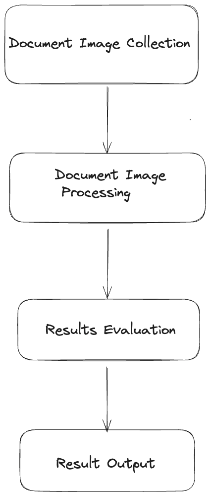
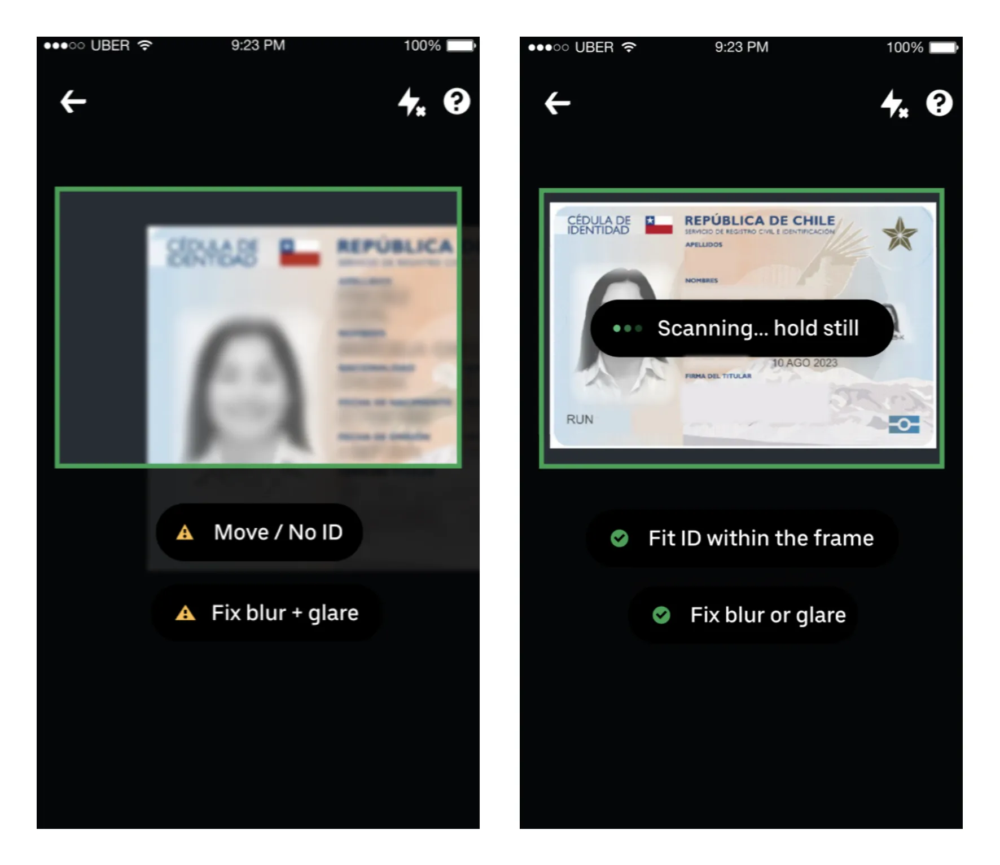

# How Real-Time Document Check works?

If you live in the USA or Canada, you must have come across the process where the dasher or the delivery person verifies your identity in case you order alcohol. Or you might have come across situations where you are asked to verify your identity when you upload your ID card to verify your identity while signing up for a service that requires ID verification. Another example of this is when the rider signs up for Uber. The rider needs to go through the ID verification process by uploading their government-backed ID to Uber’s platform.

In such scenarios, the delivery person or you upload your ID by clicking the photo in the frame, and then your ID verification process starts. It is mostly in real time, and you are able to get the result quickly. In this blog, we will see how real-time ID document checking works behind the scenes and what happens when you click that photo. We will be covering some cases of how Uber does real-time ID verification as well.

The system of uploading the document by capturing the image of the document and waiting for the results can be broken down into four major components.

1. Document Image Collection

2. Document Image Processing

3. Result Evaluation

4. Result Output

### Document Image Collection

In this step the user uploads the image and the checks are performed on the application side. In case of Uber they use machine learning to detect issues in the images such as:

.png>)

1. The image does not contain an ID

2. The image is truncated

3. The ID is not clear

### Document Image Processing

In this step, a list of steps such as document classification, transcription, and fraud detection are performed. The documents are classified on the basis of what kind of ID the user has uploaded. It can either be a driving license, a passport, or a national ID. This step is required to make sure the user has uploaded a valid ID. Once the document classification is successful, the next step is to extract information from the document.

.png>)

This step mostly uses OCR to extract character-level text from the document and determine the key fields in the document. The key fields could be date of birth, driving license number, etc. Once we have the required data from the document, fraud analysis is then done on the document data.

### Results Evaluation

.png>)

Once all the relevant data from the document is extracted and it is made sure that the user is not fraudulent, analysis is performed on the data to make sure that the data is correct or is in accordance with the requirements. For example, if the customer orders alcohol from the app, the information extracted from the document is used to make sure that the user is over the legal age for drinking alcohol. Once all the checks are successful, the data is stored in the verification table.

### Results Output

.png>)

After the user pass all the checks and the data is stored in the verification table the event is sent to the event streaming which is consumed by the Notification Service and the notification is sent to the user about the results of the output.

### Challenges with Real-Time Document Verification

There are a set of challenges while verifying the documents of the customers in real time, such as:

### Low-quality images

Low-quality images are one of the top reasons for verification failures, which can be caused by poor photo capture, overexposure, an incomplete image, etc. To solve for low-quality images during the document collection process, Uber developed a client-side machine learning model to detect low-quality images prior to photo capture.

### **ID Variations**

Each country has a different ID, but also there are countries where there could be different versions of the same id. For example in Canada there are IDs also issued not only at national level but also at the regional levels. To tackle this problem the document processing should make sure it determines the location of key fields in the document and fuses them together before output them in the key fields.

**Human-in-the-Loop**

There are few scenarios where the customers cannot produce the good quality images even with all the systems in place. In such cases the reviews are performed by humans.
