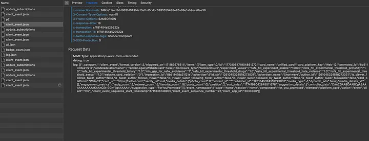
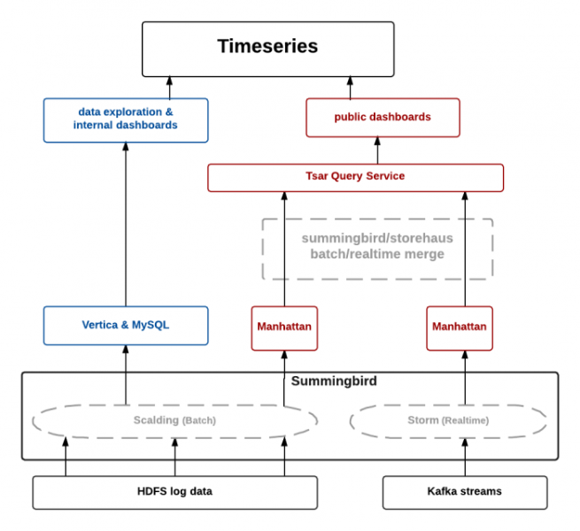
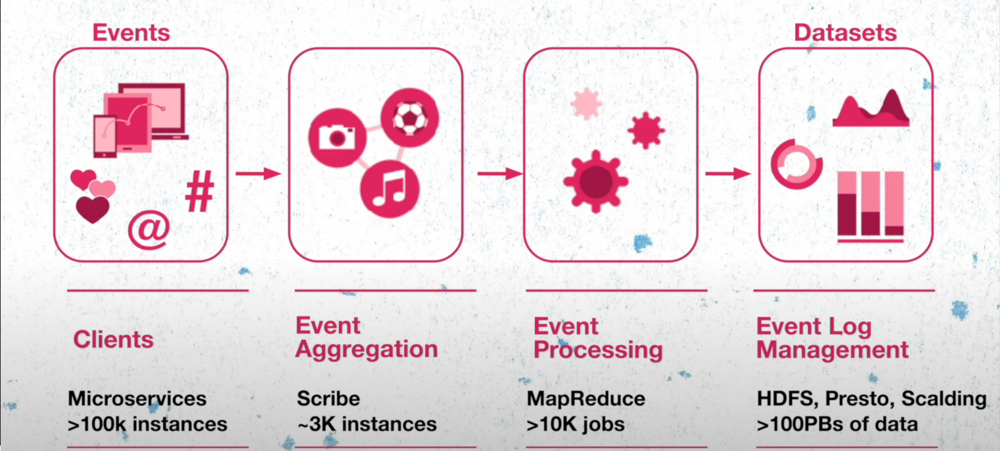
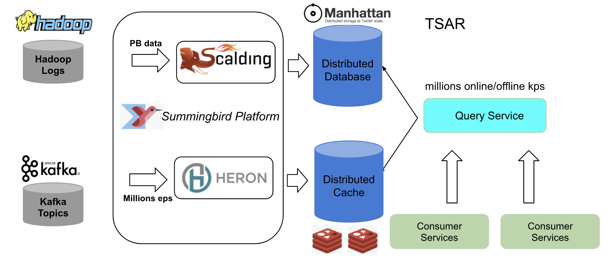
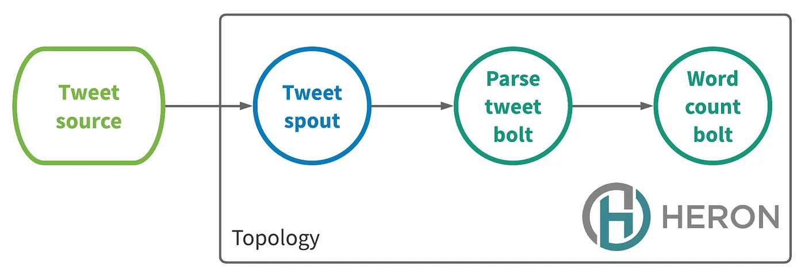
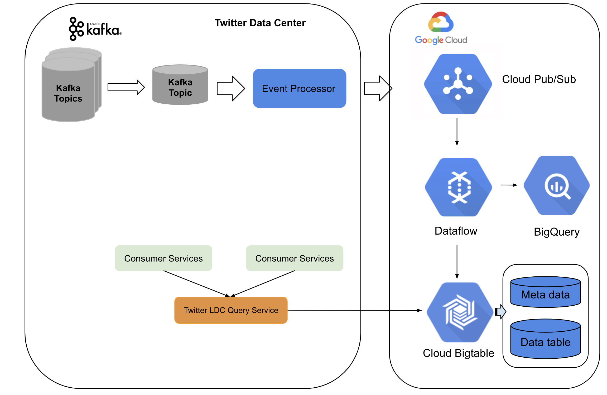
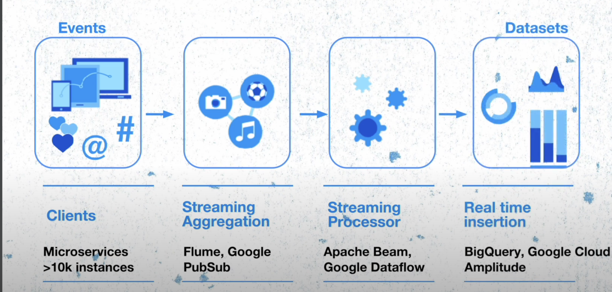
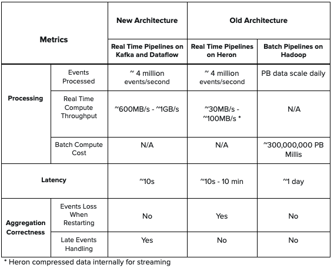

# How twitter improved processing of 400 billion events

Twitter processes approximately 400 billion events in real time and generates a petabyte of data every day. There are various event sources that Twitter consumes data from, such as distributed databases, Kafka, Twitter event buses, etc.

**In this blog we will try to understand:**

1) How twitter used to process events and what were the problems in that approach.

2) What business and customer impacts prompted twitter to migrate to the new architecture

3) The new architecture.

4) The performance comparison for old and new architectures.

**To process  events twitter has its own set of internal tools such as:**

1) Scalding is a tool that twitter uses for batch processing.

2) Heron which is twitter’s own streaming engine

3) TimeSeriesAggregator (TSAR) for batch and real time processing

4) Nighthawk Twitter’s own distributed cache

Before we dive deep into how the system of events was evolved lets discuss the 4 internal tool in short detail

**1) Scalding**

Scalding is a Scala library that makes it easy to specify Hadoop MapReduce jobs. Scalding is built on top of [Cascading](http://www.cascading.org/), a Java library that abstracts away low-level Hadoop details. Scalding is comparable to [Pig](http://pig.apache.org/), but offers tight integration with Scala, bringing advantages of Scala to your MapReduce jobs.

2) **Heron**

Apache Heron is twitter’s own stream engine, which was developed due to the need for system to handle petabytes of data, improve developer productivity and simplify debugging.

A streaming application in heron is called topology. A topology is a directed acyclic graph whose nodes represent data-computing elements and whose edges represents the streams of data flowing between the elements.

There are 2 types of nodes:

1) **Spouts**: They connect to a data source and inject the data into a stream

2) **Bolts**: They process the incoming data and emit the data

To read more about it please refer : [https://blog.x.com/engineering/en_us/a/2015/flying-faster-with-twitter-heron](https://blog.x.com/engineering/en_us/a/2015/flying-faster-with-twitter-heron)

3) **TimeSeriesAggregator**

Twitter’s data engineering team faced the challenges of processing billions of events every day in batch and in real time. TSAR a robust, scalable, real-time event time series aggregation framework built primarily for engagement monitoring: aggregating interactions with tweets, segmented along a multitude of dimensions such as device, engagement type etc.

For interactions and engagement pipelines twitter captures data from various sources such as real time streams, client and server logs. The data is used to extract tweet and user level interactions, time granularities and other metrics. 

**Now the question that arises is why? Why do twitter needs these complex tools and why do they make so much effort in extracting user level interactions from various sources?**

The answer lies in the business model of twitter, which mainly makes revenue from ads, data product services etc. This extracted data is the source of truth for twitter’s ads and revenue services which helps them to retrieve information and impression on engagement metrics.

Let us check on a very high level how things worked in twitter. All the twitter features are backed up by microservices which includes over 100k instances spread across entire world. They are responsible for generating the events which are send to event aggregation layer which is built from a open source project by meta. This layer is responsible for grouping these events running the aggregation jobs and storing the data in the HDFS. These events are then processed and format conversion, recompressing the data to create well generated datasets.

### Old Architecture

Twitter’s old architecture was based on [lambda architecture](https://www.notion.so/What-is-Lambda-Architecture-8d7b90d3e91b4666b39d419636475b55?pvs=21) which has batch layer, speed layer and the serving layer. The batch component are the logs generated by the clients stored on Hadoop Distributed File System (HDFS) after doing the event processing. Twitter built several Scalding pipelines to preprocess the raw logs and ingest them into Summingbird Platform as offline sources. The real-time component sources are Kafka topics which forms the part of the speed layer. 

Once the data is processed the batch data is stored in Manhattan distributed systems, the real time data was stored in the twitter’s own distributed cache Nighthawk.The TSAR systems such as TSAR query service which queries both the cache and the database forms the part of the serving layer.

Currently, twitter have real-time pipelines and query services in 3 different data centers. To reduce batch computing cost, twitter run batch pipelines in one data center and replicate the data to the other 2 data centers.

Can you think why real time data was stored in cache instead of a database?

### Challenges in the old architecture

Let us try to understand the challenges that this architecture can have in case of real time events

Let us understand this with an example:

Suppose there is a big event like FIFA world cup the tweet source will start to send a lot of events to the tweet topology the parse tweet bolts can not process the events in the time and there is a back pressure within the topology. When the system is under back pressure for a long time, the heron bolts can accumulate spout lag which indicates high system latency. The twitter observed that when this case happen it takes very long time for the topology lag to go down.

The operational solution that the team used was to restart the Heron containers to restart processing the stream. This can cause loss of events during the operation which could lead to inaccuracy in the aggregated counts in the cache.

Now let us try to understand the batch events example. Twitter has several heavy computation pipelines processing PB scale of data and running hourly to sync data in the Manhattan database. Now let us imagine a case where the sync job takes more than an hour and the next job is scheduled to start, this could lead to a case where the back pressure on the system could increase and lead to loss of data.

The TSAR query service as we can see consolidates both the Manhattan and the cache service to provide the data to the clients. Because of the potential loss of real-time data, the TSAR service might provide inaccurate metrics to the customers.

Now this would cause a significant problem because

1) Twitter ads services is one of the topmost revenue model for twitter if its performance is impacted it directly impacts their business model.

2) Twitter offers various data product services to retrieve information on impression and engagement metrics these services would be impacted by inaccurate data.

3) Another problem in this case is that the time from the event created to when it is available for use could take some hours because of the batch processing jobs, this would mean that the data analytics or any other operations that needed to be performed by the clients would not have the up to date data. There would be a time lag of maybe a few hours.

Now, this would mean if we want to update the user’s timeline based on the events generated by the user or perform behavioural analysis on the users on how they interact with the twitter systems, the customer would not be able to do that as they would need to wait for the batch to be completed.

### New **architecture**

 

The new architecture was built on both twitter data center services and Google Cloud platform. Twitter built a event processing pipeline which converts kafa topic to a pub sub topic which was sent to google cloud. On the google cloud streaming data flow jobs performed real-time aggregation and sink data into the BigTable. 

For the serving layer, twitter uses LDC query service with front end in twitter data centers and backend as Bigtable and Bigquery. The whole system can stream up to millions events per second with low latency upto ~10 ms and it can be easily scaled up during high traffic

This new architecture saves the cost to build the batch pipelines, and for real-time pipelines, twitter is able to achieve higher aggregation accuracy and stable low latency. Also, they do not need to maintain different real-time event aggregations in multiple data centers.

### Performance Comparison

 The new architecture provides lower latency compared with Heron topology in the old architecture and offers higher throughput. Also, the new architecture handles late events counting and does not lose events when doing real-time aggregation. Moreover, there is no batch component in the new architecture, so it simplifies the design and reduces compute cost which existed in the old architecture.

### Conclusion

With migrating the old architecture built on TSAR to the hybrid architecture on both Twitter Data Center and Google Cloud Platform, twitter is able to process billions of events in real time and achieve low latency, high accuracy, stability, architecture simplicity, and reduced operation cost for engineers.

Schedule a mock System Design Interview with me : [https://www.meetapro.com/provider/listing/160769](https://www.meetapro.com/provider/listing/160769)

Linkedin: [https://www.linkedin.com/in/mayank-sharma-2002bb10b/](https://www.linkedin.com/in/mayank-sharma-2002bb10b/)

> https://www.buymeacoffee.com/imayanks
>