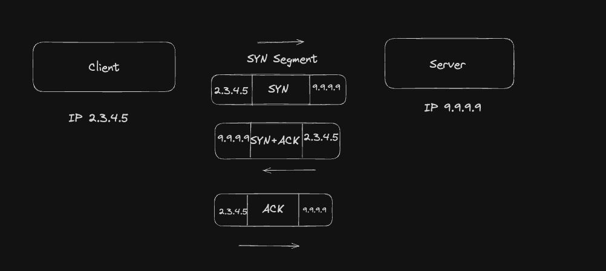
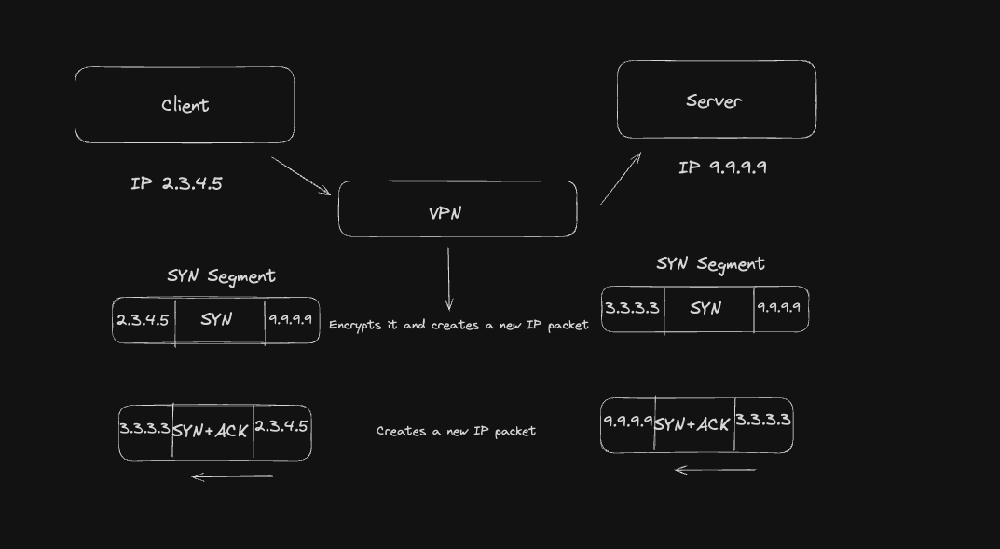

# How VPN protects your Identity

A few days ago, I was trying to go through some fundamentals of backend engineering and came across the type of messages TCP uses to establish a client-server connection. After the connection is established, real communication between the client and the server starts. While capturing my learnings from the previous articles, I got curious: how would this flow work in VPN?

VPN stands for virtual private network, and it can be defined as a service that allows you to remain private while you access the network. It does this by encrypting the traffic between the device and the internet. In this blog, we will be looking into how VPN works behind the scenes and how communication between the client and the server is established.

We will try to understand this with an example where we will see how the connection would be established in the case of a VPN vs. no VPN. We will assume the server IP to be 9.9.9.9 and the client IP to be 2.3.4.5.

### Without VPN

In the case where there is no VPN, the client will send a SYN segment to the server, which has the source IP as 2.3.4.5 and the destination IP as 9.9.9.9. The server then replies back with a SYN+ACK message, which has the source IP as 9.9.9.9 and the destination IP as 2.3.4.5. In the end, the client sends an ACK message with 2.3.4.5 as the source IP and 9.9.9.9 as the destination IP.

After the three-way handshake, the connection is then established between the client and the server to communicate over TCP.

### With VPN

Let us now study a case with a VPN how the communication would work. Let us say we have a VPN deployed with an IP address of 3.3.3.3. When the client produces the SYN message with the same destination IP, the VPN client will capture the IP packet. It will encrypt it and put it into a new IP packet with the destination as 9.9.9.9 and the source IP packet as 3.3.3.3. When the server replies back with a SYN+ACK message, the VPN server knows that this packet must go to the client 2.3.4.5, so it creates a new packet with the source IP of 3.3.3.3 and puts the SYN+ACK in it.

### References

https://nordvpn.com/what-is-a-vpn/

https://www.cisco.com/c/en/us/products/security/vpn-endpoint-security-clients/what-is-vpn.html

[https://medium.com/@hnasr/how-vpns-really-work-a5da843d0eb3](https://medium.com/@hnasr/how-vpns-really-work-a5da843d0eb3)

Schedule a mock System Design Interview with me : [https://www.meetapro.com/provider/listing/160769](https://www.meetapro.com/provider/listing/160769)

Linkedin: [https://www.linkedin.com/in/mayank-sharma-2002bb10b/](https://www.linkedin.com/in/mayank-sharma-2002bb10b/)

> https://www.buymeacoffee.com/imayanks
