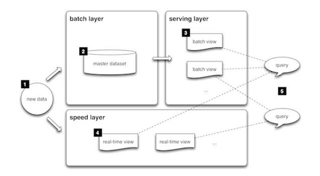

# What is Lambda Architecture?

Lambda architecture is a way of processing massive quantities of data (i.e “Big Data”) that provides access to batch processing and stream processing methods with hybrid approach. The lambda architecture was introduced by Nathan Martz in 2014, this architecture has helped data and business analysts to get instant processed data from the speed layer and more complex data from the batch layer.

The lambda architecture itself is composed of 3 layers:

1. Batch Layer

2. Speed Layer

3. Serving Layer

### Batch Layer

This layer is responsible of saving large amount of data. The data is constantly fed into the system. The batch layer processes the data in batches usually on a regular schedule and updates the master dataset with the results of processing. The batch layer has 2 very important functions that is to manage the master data set and pre-compute batch views.

### Speed Layer

The speed layer is responsible for handling large amount of data and the data that are not already delivered in batch view due to the time it takes to perform batch operations In addition it only deals with the recent data in order to provide the complete view of the data.

### Serving Layer

This layer indexes the batch views to make it queryable by the end users so that it can be queried in low latency and in ad-hoc basis. This layer also consumes data coming from the speed layer in the form of real-time views.

### What are the advantages and disadvantages for using lambda architecture?

The lambda architecture manages to reduce the latency by indexing the recent data in the speed layer. This makes it possible for critical data to be delivered whenever needed. The good part is even if batch layer fails, the speed layer will process the recent data and you can re-run the batch layer.

The disadvantage of this archetecture is that it requires two codebases for the batch and the stream layer. This just adds more complexity to the system.
