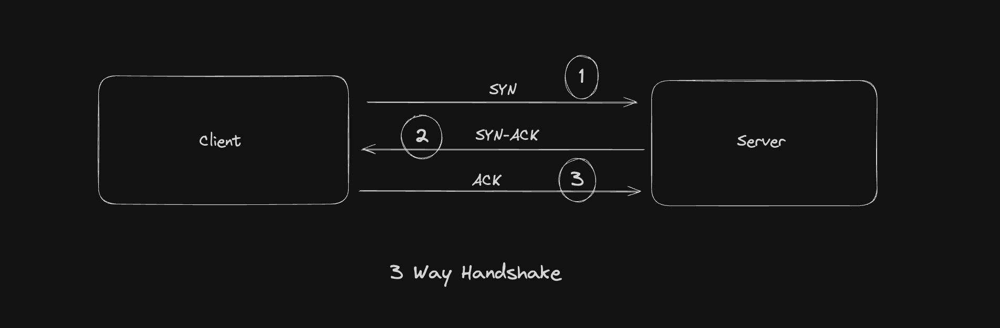
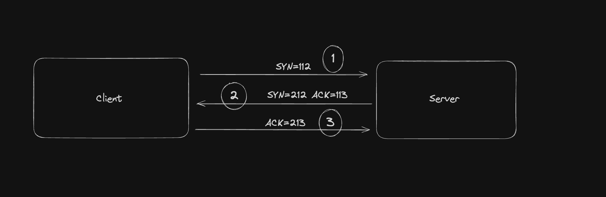

# What is TCP Three-Way HandShake?

TCP Three way handshake is a process which is used in a TCP/IP network to make a connection between client and the server. It is a 3 way process which requires both the client and the server to send and acknowledge packets before the real data communication starts.

### Types of TCP messages

**SYN(Synchronise Sequence Number)**

This is used to initiate and start the connection. In this step the client sends a segment with an SYN which informs the server that the client is likely to start the communication and with what sequence number it starts the segment with.

**SYN + ACK**

The server responds to the client request with **SYN + ACK.** It signifies the SYN from the local device and the ACK of the earlier packet.

**ACK**

Helps to confirm that the receiver has received the SYN.

**FIN**

This message is sent to terminate a connection.

### TCP Three-Way handshake Process

- Step 1 : In the first step the client establishes a connection with a server. It sends a segment with SYN and informs the server that the client is likely to start the communication and with what sequence number it starts the segment with.
- Step 2: In this step the server responds to the client request with SYN-ACK. ACK signifies the response of segment it received and SYN signifies what sequence number it should start with the segments.
- Step 3: In the final step the client acknowledges the response of the server, and they both create a stable connection.

### Example

Here is a simple example of the three-way handshake process that is consists of three steps:

- Client begins the connection by sending the TCP SYN packet to its server destination. The packets contain a random sequence number (For example, 112) that indicates the beginning of the sequence numbers for data that the client should transmit.
- After that, the Server will receive the packet, and it responds with its sequence number. It’s response also includes the acknowledgment number, that is server’s sequence number incremented with 1 (Here, it is 212).
- Host client responds to the Server by sending the acknowledgment number that is mostly server’s sequence number that is incremented by 1.

After the data transmission process is over, TCP automatically terminates the connection between two separate endpoints.
